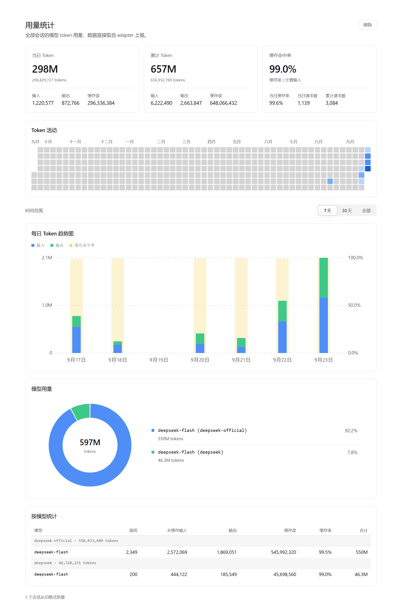

# dsh-plugin-usage-stats

跨全部会话的 token 用量统计插件（DSH）。在 Web GUI 左侧栏新增「用量统计」入口，主区域打开整页仪表盘。



Whole-corpus token usage statistics for DSH: a sidebar entry plus the dashboard it opens.

## 只做一件事

插件只回答一个问题：这些会话一共用了多少 token。除此之外它什么都不做。

- **没有设置项。** 安装即用，没有配置文件、没有需要调的参数。唯一的交互是一个「刷新」和一组 7 天 / 30 天 / 全部的时间范围切换。
- **没有估算。** 所有数字直接取自 adapter 上报的 `usage`，不推断、不按字数折算、不补零。
- **不碰模型。** 不注册工具、不注入提示词、不修改请求，对模型完全不可见，不影响 prompt 与 KV 缓存。
- **单一职责。** 一个入口、一个整页、一条只读路由（`GET /api/usage-statistics.data`）。所有区块共用同一份载荷与同一个时间窗口，不存在「图看的是 7 天、表算的是 30 天」这种漂移。
- **无额外依赖。** 宿主半是纯 Node 模块，客户端半是浏览器可直接加载的 bundle，没有构建步骤，也没有第三方运行时依赖。

## 功能

页面是一份整页报告，控件只有两个：整页的「刷新」，以及一组 7 天 / 30 天 / 全部的时间范围切换。后者只改视图窗口，载荷与统计口径不变，因此不存在「被悄悄过滤掉」的数据。时间范围控件独立成一行，同时驱动下面三块视图，三块共用一个窗口。

- **概览卡片**：当日 Token / 累计 Token（各带输入、输出、缓存读拆分）；缓存命中率（附当日缓存率、当日与累计请求数）
- **Token 活动**：一年期日热力图，GitHub 风格蓝色四级色阶；月份标签按实际渲染宽度排布、碰撞时自动丢弃，悬停任意格子显示该日全部指标
- **每日 Token 趋势图**：堆叠柱状图（输入 + 输出），外加一条更宽的浅黄色命中率柱取右轴 0–100%，作为当天堆叠的背景板
- **模型用量环图**：左侧环图 + 右侧图例（模型名 + 占比 + token 数），悬停扇区或图例显示占比、调用数、缓存率；窄卡片自动回落成上下单列
- **按模型明细表**：按供应商分组，列有模型、调用数、未缓存输入、输出、缓存读、缓存率、合计；表内滚动、表头吸顶

「全部」一档等于语料自身的跨度：如果只有 7 天 / 30 天两档，任何在更早时间用过的模型都会从环图与明细表中消失，加上「全部」后所有模型都可见。

整页与「插件」页同宽（960px 居中列）。

## 数据来源

会话事件 `assistant/message` 自带 `usage`：

```
{ inputTokens, outputTokens, cacheReadTokens, cacheWriteTokens, totalTokens }
```

计数互不重叠 —— `inputTokens` 仅为未缓存输入，计费输入 = 三者之和。模型归属取自该事件之前最近一次 `request/header` 的 `config.provider` / `config.model`。

路由：`GET /api/usage-statistics.data?days=<7..1100>`，默认 371 天（一年热力图）。`days` 是下限而非上限：语料比它更老时，窗口会回退到语料起点，否则早期模型会从环图与明细表里永久消失。走共享 `/api` 通道鉴权，因此只能在浏览器内（已登录）访问。

热力图与趋势图使用两个独立的窗口：`payload.days`（热力图）始终是整段请求窗口，`payload.trend.days`（趋势 / 环图 / 明细表）则从语料第一天起。这样热力图保留一年上下文，而「全部」不会用几个月的空列把新语料垫满。

其他实现要点：

- 持久化日志的时间戳字段是 `time`；时区偏移的符号约定为东为正，日界据此划分本地日期。
- fork 子会话的日志开头是父会话前缀的副本，插件按 `inherited: true` 标签的 `session/end-seed` 标记位置去重，避免把父会话的 token 重复计入；不带该标签的 `session/end-seed` 是普通生命周期边界，不作为切点。
- 旧格式（v0）归档中迁移层拒绝读取的部分，插件会直接读取其中的结算事件并计入（上报为 `recoveredSessions`）；语料扫描每个进程只跑一次，不可读会话计入永久集合，计数器不会随轮询增长。

## 安装

```bash
# 从 GitHub 安装
dsh plugin add https://github.com/fakeNihilist/dsh-plugin-usage-stats

# 本地开发时从目录安装
plugin_manager install_bundle <本目录绝对路径>
```

改完 `index.js` 需要重启 Host 才会加载新代码（插件是进程内已加载的模块）；客户端半（`client.js`）是浏览器按需加载的 bundle，刷新页面即可。顺序是先重启 Host、再刷新页面，反过来会短暂出现新版前端配旧版宿主。

## 开发

```bash
npm test                    # 单测：折叠层、fork 切点规则、窗口起点、客户端渲染、热力几何、悬停读数、命中率柱
npm run verify:logs         # 用真实会话日志跑一遍折叠，打印真实观测到的字段形状
npm run verify:cut          # 对比不同 fork 切点策略
npm run verify:payload      # 校验路由 payload 的各项不变式
npm run verify:read         # 逐个会话试读，定位 sessionsFailed 的真实原因
npm run verify:v0           # 检查被迁移拒绝的 v0 归档里有多少可回收的用量
npm run verify:corpus       # 完整语料扫描两遍，证明计数器幂等不增长
npm run verify:trend        # 按趋势图的口径打印输入/输出/缓存读与命中率
```

`test/` 与 `verify/` 只在开发时使用，不参与运行时；`verify/` 直接读取 `~/.dsh/sessions` 下的真实日志（多帧 zstd JSONL），把结论建立在实测数据而不是文档假设上。

## 已知限制

- 统计时区为宿主本地时区（进程启动时固化偏移量），"今天"由宿主判定并下发，浏览器不自行推断。偏移量的符号约定为东为正，改动折叠层后必须重启 Host。
- 子智能体会话的用量计入总量（它们消耗真实 token）。
- `cacheWriteTokens` 在当前 DeepSeek adapter 上恒为 0，明细表不再列出该列；在其它 provider 上写缓存会稀释命中率。
- 工作区按会话的 `cwd` 分组，没有 `cwd` 的会话以 session id 单独成组。界面不提供工作区与时间区间控件；宿主侧仍保留 `?workspace=` 与 `?start=&end=` 参数，但当前无人调用。
- `days` 是下限不是上限：语料比请求窗口更老时，两种窗口都会放宽到语料起点，热力图与趋势都可能超过一年。这是刻意的：截断会让早期模型从环图与明细表里永久消失。
- 「全部」= 语料自身的跨度（`trend.days`），不是「建库以来全部」：比路由请求窗口（默认一年，或语料起点）更早的用量不在载荷里。
- 热力图与趋势是两个窗口，改动 `buildPayload` 时不能合并，否则要么热力图丢掉上下文、要么趋势被空列垫满。
- 命中率没有计费输入的日期不画柱（比率不存在），不会被画成 0%。
- 环图与明细表在窗口内的数据由前端按天重算（`routesInRange`），依赖载荷里的 `trend.routes` 按天序列；该字段缺失时回落到整份 `routes`，宿主侧不能删掉这个字段。
- 浅色主题下的边框与说明文字由插件自己派生，会比系统其它处的同色元素略重一点；深色主题完全沿用主题原值。
